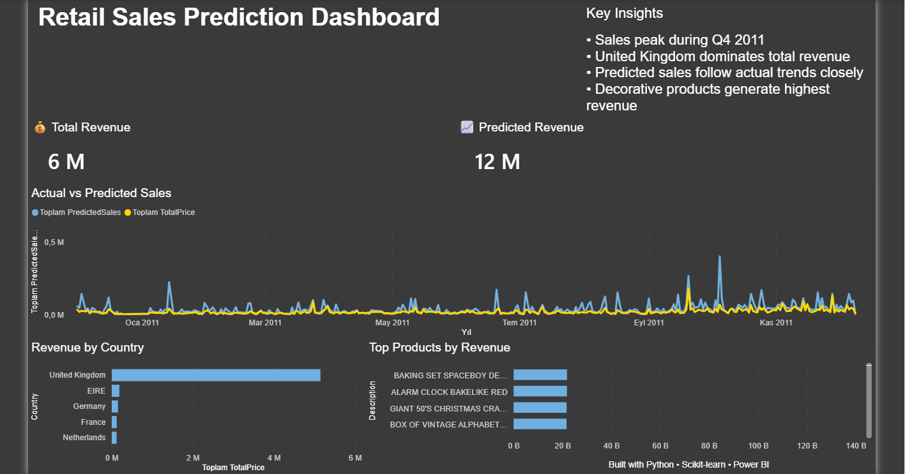

# Retail Sales Prediction ETL ML Power BI Project

An end-to-end retail sales prediction project built using Python, Scikit-learn, ETL pipelines, and Power BI.

This project demonstrates:
- Data extraction and transformation
- Feature engineering
- Machine learning model training
- Revenue prediction
- Business intelligence dashboarding

---

# Dashboard Preview



---

# Project Architecture

```text
Raw Retail Data
       ↓
ETL Pipeline
       ↓
Feature Engineering
       ↓
Machine Learning Model
       ↓
Predictions
       ↓
Power BI Dashboard
```

---

# Technologies Used

- Python
- Pandas
- Scikit-learn
- Random Forest Regressor
- Power BI
- ETL Pipeline
- Data Visualization

---

# Machine Learning Model

The project uses a:

```text
RandomForestRegressor
```

to predict retail sales revenue based on:
- Quantity
- Unit Price
- Country
- Time-based features
- Customer spending behavior

---

# Features Engineered

Additional features created from raw transaction data:

- Month
- Day
- Hour
- WeekDay
- AvgCustomerSpend
- TotalPrice

---

# Model Evaluation

Evaluation metric used:

```text
Mean Absolute Error (MAE)
```

Model performance:

```text
MAE: 0.57
```

The model successfully captures overall sales trends while slightly overestimating during peak revenue periods.

---

# Power BI Dashboard

Dashboard includes:

- Total Revenue KPI
- Predicted Revenue KPI
- Actual vs Predicted Sales Trend
- Revenue by Country
- Top Products by Revenue
- Business Insights Section

---

# Key Insights

- Sales peak during Q4 2011
- United Kingdom dominates total revenue
- Predicted sales follow actual trends closely
- Decorative products generate highest revenue

---

# Project Structure

```text
ecommerce-forecasting-etl-ml-powerbi/
│
├── data/
│   ├── raw/
│   │   └── online_retail.csv
│   │
│   └── processed/
│       ├── cleaned_retail.csv
│       ├── featured_retail.csv
│       └── predictions.csv
│
├── models/
│   └── sales_model.pkl
│
├── powerbi/
│   └── retail_sales_prediction_dashboard.pbix
│
├── src/
│   ├── extract.py
│   ├── transform.py
│   ├── feature_engineering.py
│   ├── train_model.py
│   └── predict.py
│
├── requirements.txt
└── README.md
```

---

# How to Run

Install dependencies:

```bash
pip install -r requirements.txt
```

Run ETL and ML pipeline:

```bash
py src/extract.py
py src/transform.py
py src/feature_engineering.py
py src/train_model.py
py src/predict.py
```

---

# Future Improvements

- Hyperparameter tuning
- XGBoost implementation
- Time-series forecasting models
- Interactive Power BI filters
- Deployment with Streamlit or Flask

---

# Author

Mehmet Olgun